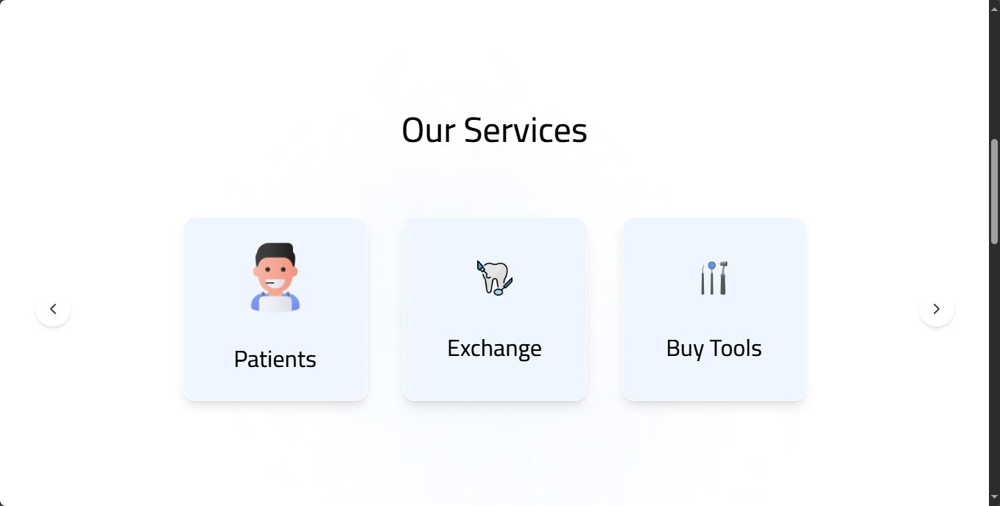
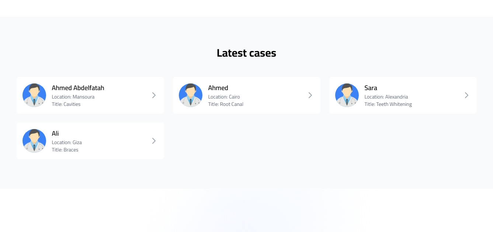

# Chapter: Home Page

The Home page is a crucial part of our platform—it’s the first impression users get when visiting the website. It must be clear, dynamic, and welcoming.

In this chapter, we'll explore the main sections, their structure, purpose, and implementation. The frontend utilizes **React**, **Next.js**, styled with **Tailwind CSS**, and manages dynamic data with **Redux**.

---

## Overview of the Home Page

The Home page is organized into several sections for clarity and ease of navigation:

- Hero Section
- Tools Section
- **Our Services Section**
- Connect Section
- **Latest Cases Section**

All sections are implemented as React components located in:
```
src/components/home/
```

The main Home page component is:
```
src/app/page.js
```

This component imports, renders the sections, and manages animations and scroll effects.

---

## Implementation Details

File: `src/app/page.js`

**Key Points:**
- Utilizes React hooks: `useState` and `useEffect`.
- Fetches the latest patient cases using Redux: `fetchLatestPatients`.
- Adds scroll-based animations for a smooth experience.
- Integrates gradient backgrounds that move during scrolling.
- Content is divided into well-structured sections.

**Simplified Structure:**
```jsx
<main>
  <HeroSection />
  <ToolsSection />
  <ServicesSection />
  <ConnectSection />
  <LatestCases cases={latestpatient?.length ? latestpatient : fallbackCases} />
</main>
```

This structure maintains code modularity and makes each section easy to manage.

---

## 1. Our Services Section

The **Our Services** section highlights the core services offered by the platform.

**Purpose:**

- Help users quickly identify the platform's offerings.
- Facilitate direct navigation to Patients, Exchange, or Shop pages.

**Features:**

- Responsive design: cards stack on mobile, align horizontally on desktops.
- Subtle hover effects enhance user experience.
- Uses `next/image` for optimized images.
- Implements `next/link` for fast client-side routing.

**Implementation:**

- React component: `components/home/ServicesSection.js`.
- Services are rendered dynamically from an array.
**Screenshot:**  


**Snippet:**

```jsx
<div className="flex flex-col md:flex-row justify-center gap-6 md:gap-12">
  {[
    { title: "Patients", icon: "/images/Home/Patients.svg", href: "/patient" },
    { title: "Exchange", icon: "/images/Home/Exchange.svg", href: "/market/exchange" },
    { title: "Buy Tools", icon: "/images/Home/buyTools.svg", href: "/market/shop" }
  ].map((service, index) => (
    <Link href={service.href} key={index}>
      <div className="w-full md:w-[250px] h-[200px] md:h-[250px] bg-[#F0F6FF] rounded-[16px] flex flex-col items-center justify-center shadow-lg hover:shadow-xl transition-shadow duration-300">
        <Image src={service.icon} alt={service.title} width={80} height={80} />
        <h3 className="font-cairo text-[24px] md:text-[32px] leading-[40px] md:leading-[60px] font-medium">
          {service.title}
        </h3>
      </div>
    </Link>
  ))}
</div>
```

---

## 2. Latest Cases Section

The **Latest Cases** section displays real patient cases submitted by dentists.

**Purpose:**

- Make the platform appear active and engaging.
- Allow new users to see shared case examples.

**Features:**

- Dynamic data: fetched from backend using Redux.
- Static fallback cases if data isn’t ready.
- Grid adjusts based on screen size: 1, 2, or 3 columns.
- Each card shows: doctor's avatar, name, location, and case title.
- Smooth scroll animations.

**Implementation:**

- React component: `components/home/LatestCases.js`.
- Styled with Tailwind CSS.
- Uses `next/image` for avatars.

**Screenshot:**  


**Snippet:**

```jsx
<div className="grid grid-cols-1 sm:grid-cols-2 lg:grid-cols-3 gap-4 md:gap-6">
  {cases.map((item, index) => (
    <div key={index} className="bg-white rounded-lg p-4 flex items-center justify-between">
      <div className="flex items-center gap-4">
        <div className="w-12 h-12 md:w-16 md:h-16 rounded-full overflow-hidden bg-blue-500">
          <Image src={item.images[0]} alt={item.name} width={64} height={64} className="object-cover w-full h-full" />
        </div>
        <div>
          <p className="font-semibold text-base md:text-lg">{item.name}</p>
          <p className="text-gray-500 text-sm">Location: {item.location}</p>
          <p className="text-gray-500 text-sm">Title: {item.title}</p>
        </div>
      </div>
    </div>
  ))}
</div>
```

---

## Summary of the Home Page

- Modular structure: each section as a separate React component.
- Uses Redux for real-time data.
- Smooth scroll-based animations for modern UX.
- Fully responsive design.
- Clear navigation to main services: Patients, Exchange, and Shop.

This approach keeps the Home page fresh, functional, and user-friendly.
